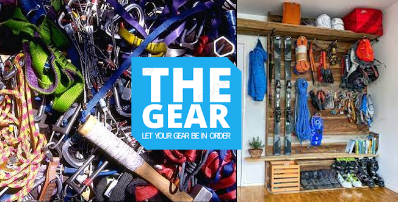
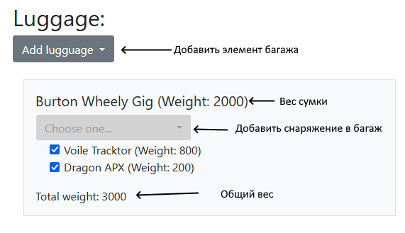
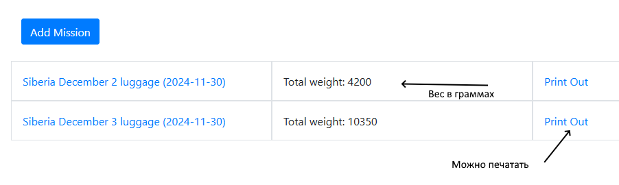

\
# The Gear
Вашему вниманию представлено вебприложение-чеклист снаряжения для активных 
видов спорта, совмещенное с трекером мест хранения и менеджером веса багажа.

Из-за сцецифичного подхода к хранению альпинистского, лыжного и походного 
снаряжения приходится хранить его в разных местах (соблюдая требования 
к влажности, температуре и освещенности помещения). Важен аспект веса багажа при перелетах. Зачастую сборы в поездку 
происходят в режиме острого дефицита времени и сайт помогает сделать это легко и эффективно.

## Содержание
- [Технологии](#технологии)
- [Начало работы](#начало-работы)
- [Структура сайта](#cтруктура-сайта)
- [To do](#to-do)

## Технологии
- [Django](https://www.djangoproject.com/)
- [Bootstrap](https://getbootstrap.com/)
- [JQuery](https://jquery.com/)

## Начало работы
Для работу понадобится выполнить установку в вирутальное окружение пакетов из
файла [requirements.txt](requirements.txt).
На сайте реализована аутентификация и авторизация средствами django.
Вот необходимые реквизиты для входа и тестирования введенных данных:
```
* login: serge 
* password: qwerty#1
```
запуск проекта выполняется коммандой 
```
python manage.py runserver
```
Не смотря на то что персонофикация данных реализована, пользователю 
на данный момемент доступна работа только с Миссиями. Ввод категрий, 
мест хранения, а так же самих предметов снаряжения выполняется через раздел
/admin сайта. Он доступен по тому же паролю.

## Структура сайта
На сайте есть 4 раздела:
1. Список доступного снаряжения с фотографиями и весом
2. Раздел миссии - это чеклисты реальных поедок, с возможность создавать 
новые проекты, вносить в них изменения, разделять вещи по багажным сумкам, 
учитывая предельный вес багажа. Здесь можно распечатать список снаряжения в 
двух проекциях - как нужно паковать багаж и в каких местах хранения искать 
передметы.
3. Справочный раздел Current Storage -  информация о том, где предметы 
находятся в данный момент, он полезен при сборах. Помогает посетить каждое 
место хранения не более одного раза. Там же доступна информация о потерянных
вещах, вещах нуждающихся в ремонте, а так же о контактах людей одолживших вещи.
4. Справочный раздел Usual Storage - список привычных мест хранения вещей.
Помогает организовать упорядоченное хранение после возвращения из миссии.

Достаточно проработан основной блок подготовке к миссии:
\
Удаение предмета осуществляется с помощью сохранения без включенной галочки.

В списке миссий доступны - общий вес и ссылка на документ пригодный для печати



## To do
1. Реализовать возможность ввода объектов предметной области через frontend
2. Предполагалась что к сайту будет сделан чат-бот-спутник, позволяющий 
просмотреть информацию о миссии в полевых условиях, тратя минимум времени 
и интернета.
3. Визуал проекта оставляет желать лучшего. Это нужно исправить.
4. Не лишней будет многоязычность.


   


